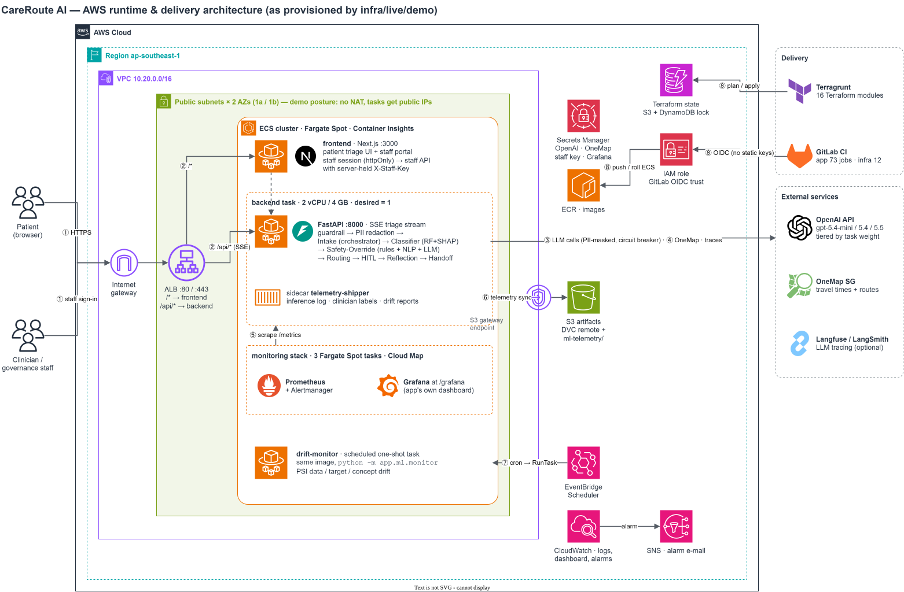
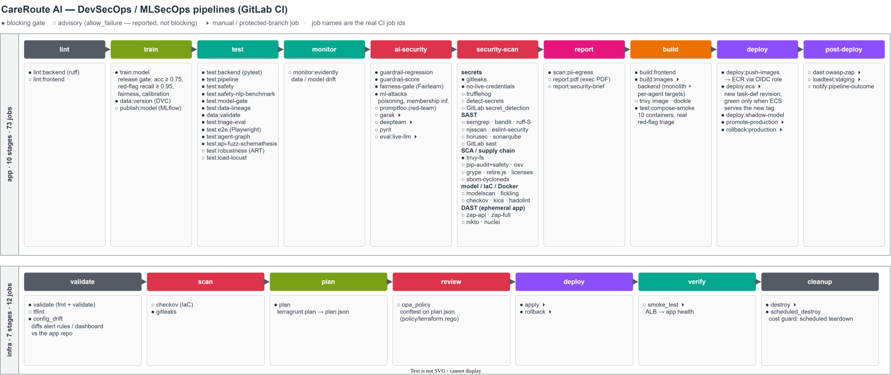

# CareRoute AI — multi-agent AI triage on AWS, shipped through a DevSecOps/MLSecOps pipeline

A patient types symptoms in plain language, in any of several languages. CareRoute returns an urgency level (P1–P5), a care
tier and a real nearby clinic, and a cited explanation. Anything urgent or uncertain goes to a human clinician, who makes the decision.


> **Academic prototype.** This was built for the NUS-ISS MTech *Architecting AI Systems* practice module (Team 3). It is
> **not** a certified medical device. Do not use it for real clinical decisions.



<sub>Editable source: [`docs/architecture.drawio`](docs/architecture.drawio). PNG fallback: [`docs/architecture.png`](docs/architecture.png).</sub>

This repository is a **public, single-commit snapshot** of two private GitLab repos:

| Path | What it is | Source |
|---|---|---|
| [`app/`](app/) | FastAPI multi-agent backend, Next.js frontend, ML model + MLOps, monitoring configs, the 10-stage app pipeline | `careroute_ai_app@ec8b3da` (main, 2026-09-29) |
| [`infra/`](infra/) | Terraform modules composed by Terragrunt into one AWS stack, plus the infra pipeline | `careroute_ai_infra@bebaf5d` (main, 2026-09-29) |

## Why this exists

Someone who feels unwell often doesn't know whether they need A&E, a polyclinic, a GP, or just rest. A wrong guess costs
something either way: an emergency that waits at home is dangerous, and a mild case in A&E lengthens the queue for sicker
patients. CareRoute answers three questions: *how urgent is this*, *where should I go*, and *why*. Each decision is
explainable and auditable, and a clinician keeps the final say.

## Highlights: engineering decisions and their trade-offs

- **A hybrid system with a deterministic floor under every AI step.** CareRoute is not "all-LLM": it has one trained model
  (a RandomForest with SHAP), several bounded LLM steps, and rules wherever predictability matters most. Every worker tries
  its LLM step first and falls back to rules, so the system still returns a safe answer with no LLM at all. The whole test
  suite runs that way, which keeps the fallback path from rotting. The kill switch `CAREROUTE_KILL_SWITCH=1` forces the
  fallback path in production without a redeploy. See `app/backend/app/agents/`, `app/backend/app/llm.py`.
- **Safety rules can only raise acuity, never lower it.** The red-flag table (`app/backend/app/redflags.py`, 14 categories)
  can't be overridden by the model or the LLM. The clinical-NLP shadow pass and the LLM adjudicator
  (`app/backend/app/safety_nlp/`) are separate layers, and they can also only escalate. The planner may reorder steps per
  case, but every plan is checked against an explicit transition graph (`app/backend/app/agents/planner.py`), and a
  rejected plan falls back to the fixed, safety-gated sequence.
- **Personal data is masked before any agent runs.** NRIC, phone, email and MRN are redacted up front
  (`app/backend/app/redact.py`), so the masked text is all that agents, logs, traces and the LLM provider ever see. The input
  guardrail has 6 layers and no LLM dependency: normalisation, decode-and-rescan, a denylist, structural detection and
  topical scoping (`app/backend/app/guardrail.py`). The audit log is a SHA-256 hash chain, so tampering is detectable.
- **The microservice split is a deployment switch, not a code fork.** `AGENT_TRANSPORT=http` runs each agent in its own
  container behind a `RemoteAgent` proxy. The service boundaries follow secrets, state and resource profile: only
  `llm-gateway` holds the API key. A parity test (`app/backend/tests/test_ms_transport_parity.py`) checks that the gold
  vignettes produce identical decisions in-process and over HTTP. When an agent is down, the case is escalated to a human
  rather than given a lower care tier.
- **The model release gate is the same code at train time and in CI.** Training refuses to persist a model below
  accuracy 0.75 or red-flag recall 0.95, and CI's `test:model-gate` enforces the same floors. The artifact is
  content-addressed (SHA-256), and a feature contract rejects train/serve skew at load time
  (`app/backend/app/ml/feature_contract.py`). A Fairlearn fairness gate, drift checks (PSI) and a clinician-label feedback
  loop cover the model after release.
- **The AWS footprint is costed, and the cost-driven choices are labelled.** The demo env runs Fargate **Spot**, puts tasks
  in public subnets instead of paying for NAT, has no RDS because the app has no DB client yet, and skips API Gateway
  because it would break the SSE stream. It tears itself down via `scheduled_destroy`. `live/staging` shows the production
  shape: private subnets, NAT, on-demand capacity and autoscaling. Reasoning and numbers:
  [`infra/COST.md`](infra/COST.md), [`infra/live/demo/terragrunt.hcl`](infra/live/demo/terragrunt.hcl).
- **CI deploys with keyless OIDC and is honest about which scanners gate.** GitLab CI assumes an IAM role through OIDC
  (`infra/modules/ci_oidc/main.tf`). The trust policy is keyed on the project's numeric ID, not its path, and CI holds no
  static AWS keys for image push or ECS rollout. `deploy:ecs` goes green only once ECS is actually serving the new tag.
  Every scanner is labelled as a blocking gate or advisory (`allow_failure`), rather than implying everything blocks. See
  the pipeline below.

## The DevSecOps / MLSecOps pipeline



<sub>Source: [`docs/pipeline.drawio`](docs/pipeline.drawio). The app pipeline is in [`app/.gitlab-ci.yml`](app/.gitlab-ci.yml) and the infra pipeline in [`infra/.gitlab-ci.yml`](infra/.gitlab-ci.yml).</sub>

| Concern | Tools in CI |
|---|---|
| LLM red-teaming | Promptfoo, Garak, DeepTeam, PyRIT, plus guardrail regression and scoring gates |
| Responsible AI | Fairlearn fairness gate, poisoning and membership-inference tests, ART evasion (robustness) |
| Secrets | Gitleaks, TruffleHog, detect-secrets, GitLab Secret Detection, a custom `no-live-credentials` check |
| SAST | Semgrep, Bandit, Ruff-S, njsscan, ESLint-security, Horusec, SonarQube, GitLab SAST |
| SCA / supply chain | Trivy, pip-audit + Safety, OSV, Grype, retire.js, license scan, CycloneDX SBOM |
| Model artifacts | modelscan, fickling (serialized-model scanning) |
| IaC / containers | Checkov, KICS, tflint, OPA/Conftest on the Terraform plan, Hadolint, Trivy image, Dockle |
| DAST / API | OWASP ZAP (API + full), Nikto, Nuclei, Schemathesis API fuzzing |
| Privacy | `scan:pii-egress`, which checks that no personal data leaves in LLM or trace payloads |

## How it works

The numbers match the steps drawn on the architecture diagram.

1. **Entry.** A patient or a signed-in clinician reaches the internet-facing **ALB** through the internet gateway.
2. **Routing.** `/*` goes to the **Next.js frontend** task. `/api/*` goes to the **FastAPI backend**, which streams every
   agent step back over Server-Sent Events (the ALB `idle_timeout` is set for SSE). Staff calls pass through the
   frontend's server-side route handler, which attaches a server-held `X-Staff-Key`, so the key never reaches the browser.
3. **Agent pipeline.** The request goes through the guardrail, then PII redaction, then *Symptom-Intake* (which also
   orchestrates), *Severity-Classifier* (RF + SHAP + RAG citations), *Safety-Override*, *Care-Routing*,
   *Human-in-the-Loop*, *Reflection*, and finally *Clinician-Handoff* (escalated cases only). LLM calls go to OpenAI and
   are routed by task weight (`gpt-5.4-mini` / `gpt-5.4` / `gpt-5.5`) behind a circuit breaker.
4. **Real-world lookups.** Care-Routing runs a bounded ReAct loop over OneMap for travel times and routes. It falls back to
   a labelled straight-line estimate when OneMap is unavailable.
5. **Observability.** Prometheus, Alertmanager and Grafana run on Fargate using the app's *own* alert rules and dashboard.
   Prometheus scrapes `/metrics` through Cloud Map. The CI job `config_drift` fails if those configs drift from the app
   repo.
6. **ML telemetry.** A sidecar syncs the inference log, clinician ground-truth labels and drift reports to S3 through the
   gateway endpoint. The same bucket is the DVC remote.
7. **Drift monitoring.** EventBridge Scheduler launches a one-shot Fargate task (same image,
   `python -m app.ml.monitor`) that computes PSI data, target and concept drift. CloudWatch alarms go to SNS.
8. **Delivery.** GitLab CI assumes an IAM role via OIDC to push images to ECR and roll ECS. Terragrunt manages
   everything else, with state in S3 and locking in DynamoDB.

## Tech stack

| Layer | Tech |
|---|---|
| Frontend | Next.js (App Router), React, CSS Modules, Playwright |
| Backend / agents | Python, FastAPI (SSE), in-process A2A message bus, optional LangGraph adapter, Redis write-through |
| ML | scikit-learn RandomForest + isotonic calibration, SHAP, Fairlearn, PSI drift, MLflow registry, DVC |
| LLM / RAG | OpenAI-compatible provider chain with tiers and a circuit breaker; hybrid TF-IDF + dense retrieval (RRF); Langfuse / LangSmith tracing |
| Safety NLP | Clinical NER, assertion and NLI models, hash-pinned via `app/backend/models/safety/manifest.json` |
| Infra | Terraform + Terragrunt, AWS VPC, ALB, ECS Fargate (Spot), ECR, Secrets Manager, S3, DynamoDB, Cloud Map, EventBridge Scheduler, CloudWatch, SNS, IAM OIDC |
| Observability | Prometheus, Alertmanager, Grafana, CloudWatch (optional ADOT → EMF) |
| CI/CD | GitLab CI: app pipeline with 10 stages and 73 jobs; infra pipeline with 7 stages and 12 jobs |

## Getting started

**Prerequisites:** Python ≥ 3.10 and Node ≥ 18. Docker is optional. **No API key is needed**: without one, every agent
uses its deterministic fallback.

```bash
cd app
pip install -r backend/requirements.txt -r backend/requirements-dev.txt
./dev.sh                      # backend :8000 + frontend :5173 (hot reload)
# or the production-like stack (10 backend containers + Prometheus/Grafana):
docker compose up --build
docker compose --profile tracing up   # adds self-hosted Langfuse
```

Configuration goes in `app/backend/.env`. Copy it from [`app/backend/.env.example`](app/backend/.env.example), which ships
with every value blank. The main keys:

| Key | Purpose |
|---|---|
| `OPENAI_API_KEY`, `OPENAI_MODEL_FAST/DEEP/MAX` | LLM provider and tier models (leave blank for deterministic mode) |
| `ONEMAP_EMAIL`, `ONEMAP_PASSWORD` | OneMap routing (optional) |
| `LANGFUSE_*`, `LANGSMITH_*` | LLM tracing (optional) |
| `CAREROUTE_SAFETY_NLP`, `CAREROUTE_SAFETY_LLM` | Safety-NLP shadow pass and LLM adjudicator (off by default) |

**Model and data artifacts are not committed.** The severity model is built by `python -m app.ml.train` (CI: `train:model`),
and the training dataset regenerates from `app/backend/app/ml/data.py` via `app/backend/app/ml/export_dataset.py`. The DVC
remote in `app/.dvc/config` is private. The Safety-NLP transformer models are downloaded and hash-checked from Hugging Face
by `app/backend/app/safety_nlp/prefetch.py`. No file in this snapshot is over 5 MB.

**Deploying to AWS** (your own account; see [`infra/README.md`](infra/README.md)):

```bash
cd infra/live/demo
export TF_VAR_openai_api_key=...      # optional; never committed
IMAGE_TAG=<git-sha> terragrunt apply
terragrunt output app_url
terragrunt destroy                    # the demo is designed to be torn down
```

## Project structure

```
app/
  backend/app/agents/        one file per agent + orchestration, planner, A2A bus, contracts
  backend/app/ml/            training, release gate, SHAP, fairness, drift, registry lifecycle
  backend/app/safety_nlp/    clinical-NLP shadow pass + LLM adjudicator
  backend/app/microservices/ agent-per-container transport (RemoteAgent, llm-gateway)
  backend/tests/             pytest suites (unit, contract, safety, eval, e2e, security)
  frontend/                  Next.js patient triage UI + staff portal
  monitoring/                Prometheus rules, Alertmanager, Grafana dashboard
  security/                  LLM red-team configs (Promptfoo, DeepTeam)
  .gitlab-ci.yml             10-stage DevSecOps/MLSecOps pipeline
infra/
  modules/                   16 Terraform modules (networking, alb, ecs_service, monitoring_stack, ci_oidc, ...)
  live/demo, live/staging    Terragrunt environments (cost-minimal vs production-shaped)
  policy/terraform.rego      OPA policy run on the plan
  .gitlab-ci.yml             validate → scan → plan → review → deploy → verify → cleanup
docs/                        architecture + pipeline diagrams (draw.io)
```

## Testing & quality

- **~1,300 backend test functions** (`grep -c "def test_"` counts 1,297 across 108 files in `app/backend/tests`). Markers
  scope each agent: `pytest -m classifier|safety|routing|hitl|...`. `-m contract` checks that no agent writes outside its
  declared lane, and `-m capability` checks that each worker's agent/policy-node claim matches what it implements.
- **Browser tests**: Playwright e2e plus Node unit tests in `app/frontend/tests`.
- **Evaluations as code** in `app/backend/app/evals/`, each with a dataset, metrics and acceptance criteria. Examples:
  retrieval Recall@2, context precision, tool-call accuracy, grounding.
- **`test:compose-smoke`** passes only if a real red-flag triage completes, escalates, and reaches all six agent containers.
  A fully degraded run can't pass it as healthy.
- The full suite takes about 55 minutes (two evaluations drive the real pipeline over a gold set). This snapshot was not
  re-run for publication.

## Design decisions, limitations & roadmap

- **Clinical state is held in memory, with Redis write-through.** That is why the backend runs a single task
  (`backend_desired_count = 1`, enforced by a Terraform guard). Scaling it out needs a shared store first.
- **The demo network is deliberately cheap:** public subnets and no NAT. Use `live/staging` for the private-subnet shape.
- **RDS and MLflow modules exist but are off,** because the app has no database client yet. They are the migration target.
- **Some deploy strategies are only partly exercised.** Shadow and canary logic is unit-tested (`app/backend/app/ml/canary.py`),
  and promotion is manual.
- **Training data is synthetic**, documented in `app/backend/DATASHEET.md` and `MODEL_CARD.md`. It has no real patient data.
- Advisory scanners report findings without blocking. Promoting them to gates is the next hardening step.

More detail: [`app/README.md`](app/README.md) (full system write-up), [`app/ASPECTS.md`](app/ASPECTS.md) (course-aspect
traceability), [`app/backend/SECURITY.md`](app/backend/SECURITY.md) (OWASP LLM + Agentic Top 10 risk register),
[`infra/README.md`](infra/README.md), [`infra/COST.md`](infra/COST.md).

## Team & attribution

This is a team project for the **NUS-ISS MTech — Architecting AI Systems practice module, Team 3**. Per-member write-ups are
in [`app/docs/team/`](app/docs/team/).

| Member | Primary ownership |
|---|---|
| **James Koh** | Severity-Classifier agent, the ML/MLOps stack, the agent platform (contracts, A2A bus, guardrails, audit), CI/CD + security pipeline, all AWS infrastructure |
| Sham Goh | Symptom-Intake agent and the pipeline orchestrator |
| Aaron Liew (Yong Xi Liew) | Safety-Override agent, red-flag engine, Safety-NLP layer |
| Marcus Teh | Care-Routing agent, clinic/travel data, routing UI |
| Heriz Yusoff | Human-in-the-Loop and Clinician-Handoff agents and their evaluations |

**James's share, from git history** (`git shortlog -sn` on `main` of each repo, with his three author identities merged):

| Repo | Commits by James | Lines added by James |
|---|---|---|
| `careroute_ai_app` | 337 of 413 (≈ 82 %) | ≈ 114k of 142k (≈ 80 %) |
| `careroute_ai_infra` | 52 of 52 (100 %) | all |

By area of the app repo, he wrote ≈ 99 % of the lines added to `.gitlab-ci.yml`, 100 % of `monitoring/` and the
microservice transport, ≈ 97 % of `backend/app/ml/`, and ≈ 63 % of the agent package and tests. The Safety-NLP package is
≈ 92 % Aaron Liew's work. Lines added are a rough proxy for effort, not a measure of it.

The snapshot was sanitized for publication. The AWS account ID was replaced with `123456789012` and the team alert inbox
with `alerts@example.com`. No git history, `.env` files or Terraform state are included.

---

James Koh · [GitHub](https://github.com/gcjk768)
