# CareRoute AI — an AI Triage Assistant for Singapore Primary Care

**NUS-ISS "Architecting AI Systems" Practice Module · Team 3 · Proposal 3**

> **AI assists, the clinician decides.** This is a Practice-Module prototype, **not** a certified
> medical device. Do not use it for real clinical decisions.

**At a glance:** 7 agents · 1 trained model · 1674 backend tests + 20 browser tests · 10-stage CI/CD
with 10 blocking gates · 15 evaluations · accuracy 0.905, red-flag recall 0.997, fairness gap cut from
0.515 to 0.143 · live scenario suite 32/32 on the AWS demo (25 Sep 2026).

---

## Contents

| # | Section | |
|---|---|---|
| 1 | [What this application is](#1-what-this-application-is) | the problem, in plain English |
| 2 | [The system, and how it works](#2-the-system-and-how-it-works) | architecture + pipeline |
| 3 | [A worked example](#3-a-worked-example-real-output) | real output from a real run |
| 4 | [How the agents talk to each other](#4-how-the-agents-talk-to-each-other) | A2A, diagrams |
| 5 | [Three design decisions](#5-three-design-decisions) | why it is built this way |
| 6 | [What we built — by team member](#6-what-we-built--by-team-member) | individual contribution |
| 7 | [Where each graded module is demonstrated](#7-where-each-graded-module-is-demonstrated) | the marking map |
| 8 | [How we evaluated it](#8-how-we-evaluated-it) | E1–E15, metrics and bars |
| 9 | [Does it actually work?](#9-does-it-actually-work--the-evidence) | measured results |
| 10 | [Safety and security](#10-safety-and-security) | what could go wrong |
| 11 | [The MLOps pipeline](#11-the-mlops-pipeline) | CI/CD, diagrams |
| 12 | [Running and checking it](#12-running-and-checking-it) | commands |
| 13 | [API and configuration](#13-api-and-configuration) | endpoints, env vars |
| 14 | [What we would do next](#14-what-we-would-do-next) | honest roadmap |
| 15 | [Glossary](#15-glossary) | triage terms |
| 16 | [Further reading](#16-further-reading) | the rest of the docs |

---

## 1. What this application is

Someone feels unwell and doesn't know where to go. A&E? A polyclinic? A GP? Wait until tomorrow?
Guessing wrong is expensive in both directions — a real emergency that waits at home is dangerous, and
a mild complaint in A&E adds to a queue that someone sicker is standing in.

**CareRoute takes a plain-language description of symptoms and answers three questions:**

| Question | Answer it gives | Example |
|---|---|---|
| **How urgent is this?** | An acuity level, P1 (most urgent) to P5 | `P1 — resuscitation` |
| **Where should I go?** | A care tier and a specific, real, currently-open clinic | `Emergency Dept — call 995` |
| **Why?** | A plain-language reason, cited to clinical guidance, plus the factors that drove it | *"sudden one-sided weakness is a stroke red flag"* |

Everything is explainable, every decision is auditable, and anything urgent or uncertain is **routed to
a human clinician** rather than decided by the machine.

**Who uses it**

- **A member of the public** — describes symptoms in their own words, in any language, and gets a
  recommendation with a plain "what to do now" step.
- **A clinician** — reviews a queue of escalated cases, sees the full reasoning and evidence, and
  records the final decision. That decision becomes training-grade ground truth.

### What it looks like

The patient page. The emergency banner is always visible — the tool never gets between someone and
emergency help — and the AI-use and privacy disclosure is shown up front, before anything is typed.

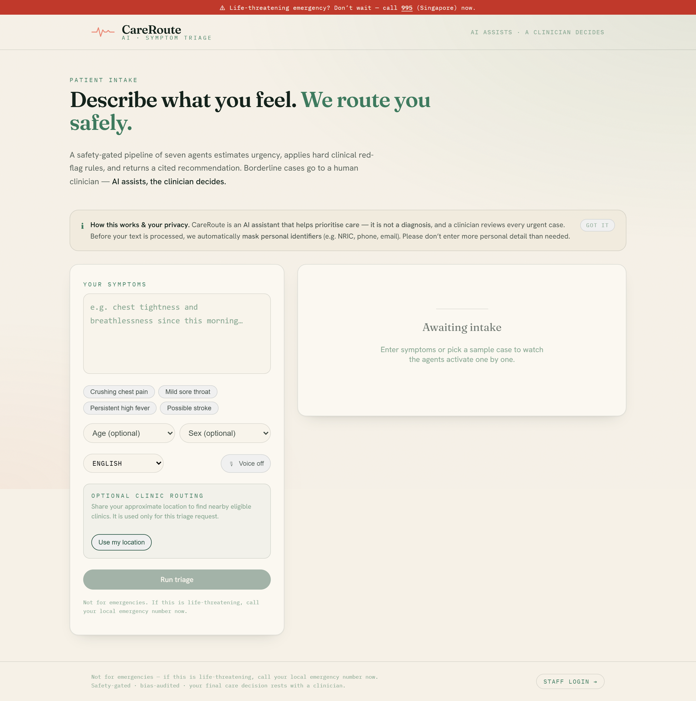

**The clinician side.** The staff portal has three surfaces, behind a real sign-in: the password is
checked on the server and answered with a signed, httpOnly session cookie, and without it the
escalation API returns 401. The password lives only in AWS Secrets Manager.

*Clinician review* — the escalation queue. Each case is tagged with **why** it was escalated (which
red-flag rule fired, or the confidence that was too low), and the detail panel shows the rationale,
evidence, feature contributions and the handoff summary before the clinician records a decision that
**supersedes** the AI:

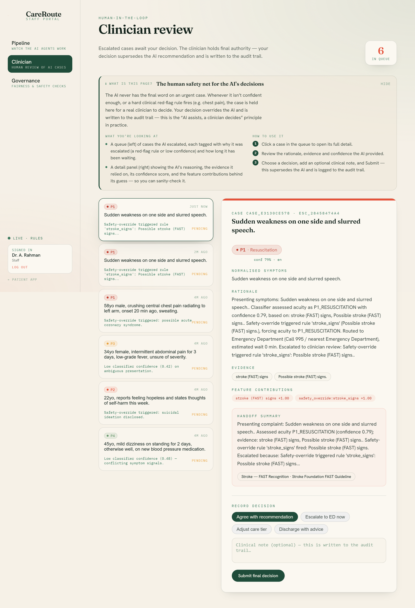

*Governance* — the fairness audit a governance officer signs off before promotion: overall accuracy,
red-flag recall, the fairness gap before and after mitigation, the worst-performing subgroup, and
drift monitors:

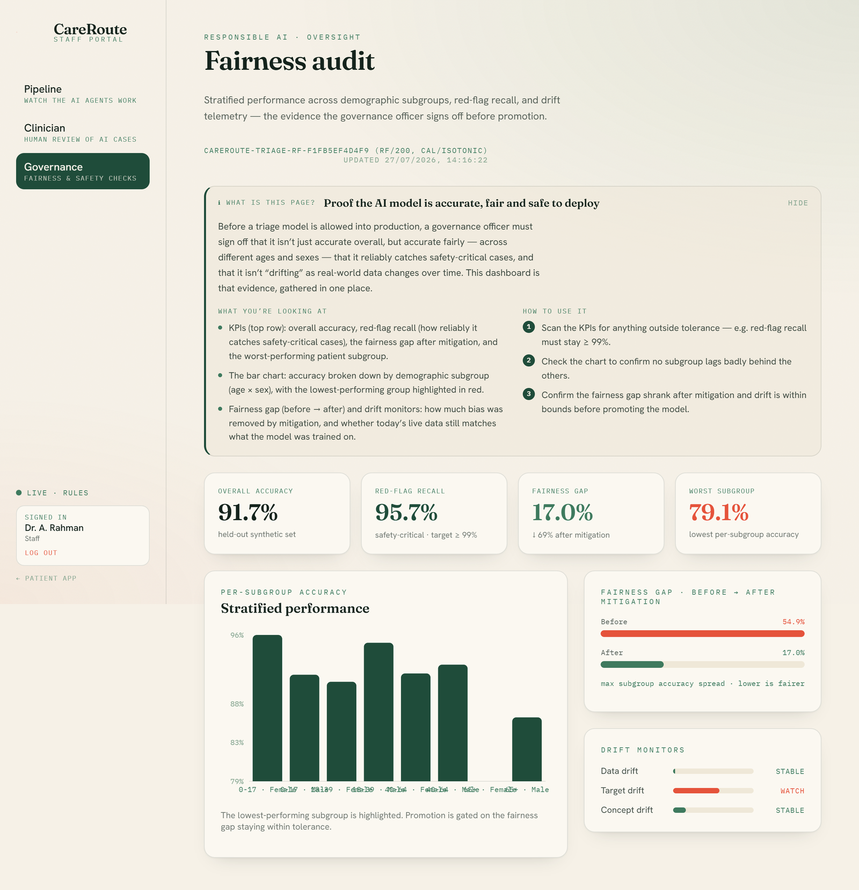

*Pipeline* — a live view of the agents working, case by case
([screenshot](docs/screenshots/staff-pipeline.png)).

---

## 2. The system, and how it works

### What the system is made of

Six tiers. Note what is **optional**: no LLM provider and no map API are required — the system runs
fully on deterministic logic, which is exactly how the test suite exercises it.

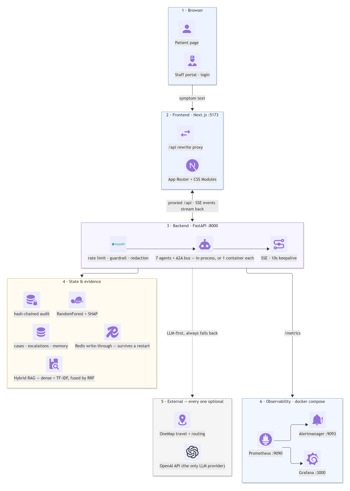

`docker compose up` brings up the full microservice stack: the intake-gateway, six agent containers,
`llm-gateway`, `rag-service`, Redis, the frontend, Prometheus, Alertmanager and Grafana.

> The **logical architecture** (named style, agents, components, pattern vocabulary), the **physical
> architecture** (stack, deployment model, NFRs), the **UML deployment diagram** and the **target cloud
> architecture** are in [`docs/ARCHITECTURE.md`](docs/ARCHITECTURE.md).

### One agent, one container — and why that is not what we deploy

Each agent can run as its own HTTP service, with the intake-gateway as the gateway and orchestrator.
`AGENT_TRANSPORT` chooses which:

| `AGENT_TRANSPORT` | What runs | Where it is used |
|---|---|---|
| unset / `inprocess` *(default)* | every worker in one process | the test suite, and the **deployed** image |
| `http` | ten containers, one per agent | `docker compose up`, and the CI compose smoke test |

**This is a switch, not a fork.** `tests/test_ms_transport_parity.py` asserts that all 20 gold
vignettes reach the *identical* decision and the identical agent conversation either way — that test
is what makes the split a deployment choice rather than a second behaviour to keep in step.

An unavailable agent never makes the outcome less safe: a missing classifier, safety, routing or HITL
answer **escalates** the case to a clinician, a missing safety answer fails the route gate closed, and
the care tier is never lowered. Because a degraded case still completes and looks healthy, the
`AgentDown` alert fires on call *outcomes* rather than on a circuit breaker.

**What AWS actually runs is the single-process `monolith` image on one compute.** That is a cost
decision: ten containers need a 2 vCPU / 8 GB ECS task instead of one, and ten ~1.1 GB images would
bill ECR storage for images nothing pulls. CI still builds and scans all twelve images every pipeline
— that is the evidence the split holds — but only `backend` and `frontend` are published
(`CAREROUTE_PUSH_IMAGES`).

Diagrams: [`docs/diagrams/careroute-agents.html`](docs/diagrams/careroute-agents.html) (interactive —
search, focus, trace, three guided views) and [`careroute-agents.mmd`](docs/diagrams/careroute-agents.mmd)
(editable Mermaid / draw.io source). The deployed AWS shape lives in the infra repo at
`docs/diagrams/careroute-aws.drawio`.

### The patient journey

A patient's words go through a **safety-first pipeline**. Nothing reaches an AI agent until it has been
rate-limited, screened for attacks, and stripped of personal identifiers.

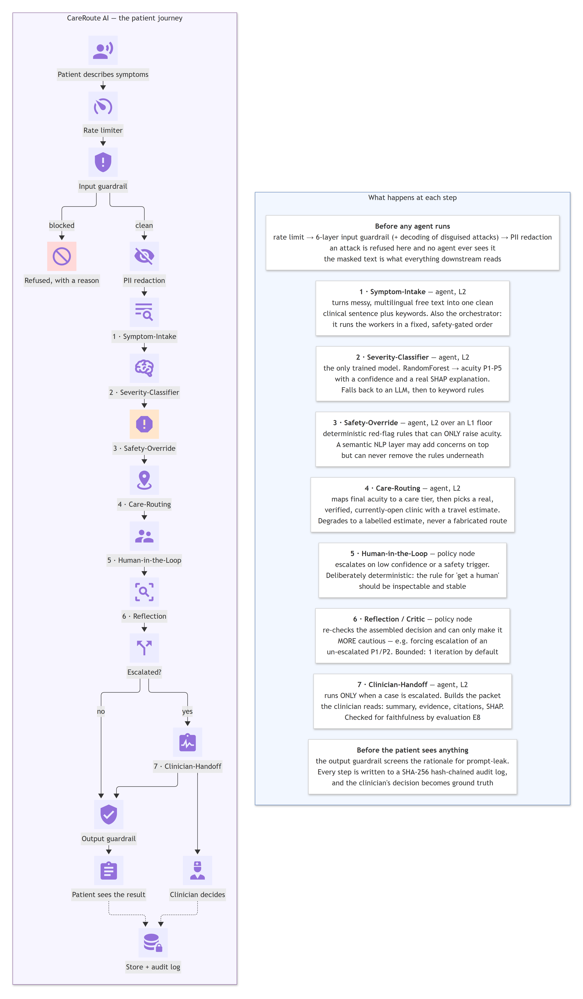

**The single most important design rule:** every step tries an AI reasoning call **first**, and falls
back to deterministic rules if the AI is slow, wrong, refusing, or absent. The system therefore always
produces a safe answer — *including with no AI available at all*, which is exactly how the automated
test suite runs it. AI can make the result better; it cannot make it unsafe.

**Why step 3 is not an AI decision.** Safety-Override is a fixed set of clinical red-flag rules that
can **only raise urgency, never lower it**. Chest pain becomes P1 whatever the model thought. That is
deliberate: *a safety interlock that could be argued out of is not an interlock.* A semantic layer
sits on top and can add more concerns, but can never remove the rules underneath. If the AI
hallucinates it can cost us precision — it cannot cost us a missed emergency.

---

## 3. A worked example (real output)

Not an illustration — this is the actual API response for one case, with the LLM switched off so the
deterministic path is what answers.

**Input:** `"sudden weakness on one side and slurred speech"` · age band `65+` · sex `F`

| Field | Value |
|---|---|
| **Acuity** | `P1_RESUSCITATION` — "Resuscitation" |
| **Care tier** | `Emergency Department` |
| **Where to go** | `Call 995 / nearest Emergency Department` |
| **Confidence** | `0.791` |
| **Escalated?** | `true` |
| **Why escalated** | `Safety-override triggered rule 'stroke_signs': Possible stroke (FAST) signs.` |
| **Citation** | *Stroke — FAST Recognition*: "Facial droop, Arm weakness, and Speech difficulty are the core FAST indicators of acute stroke. Time of onset is critical…" |
| **Explanation** | `stroke (FAST) signs` (weight 1.0) · `safety_override:stroke_signs` (weight 1.0) |
| **Reflection critic** | `passed: true`, no issues, no corrections |

Note what happened: the classifier was only **0.791** confident, but the deterministic safety rule
fired and forced P1 regardless — and the escalation reason names the exact rule, so a clinician can
see *why* rather than being told "the model said so". The whole exchange is recorded on the message
bus and written to the hash-chained audit trail.

Here is that same case in the UI — note the Safety-Override node flagged red, the plain-language
"what to do now", the SHAP feature contributions, and the cited FAST stroke guideline:

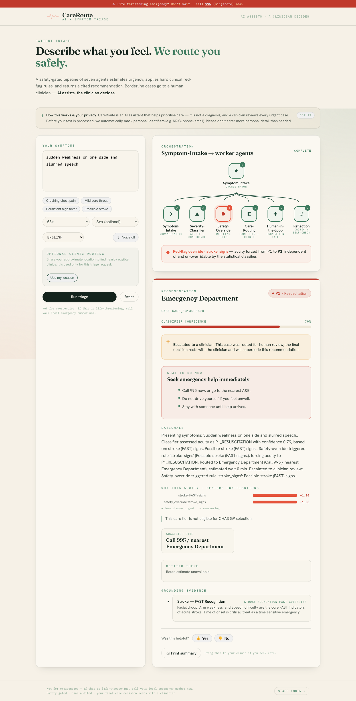

Reproduce it:

```bash
cd backend && CAREROUTE_KILL_SWITCH=1 python -m uvicorn app.main:app --port 8000
curl -N -X POST localhost:8000/api/triage/stream -H "Content-Type: application/json" \
  -d '{"text":"sudden weakness on one side and slurred speech","ageBand":"65+","sex":"F"}'
```

---

## 4. How the agents talk to each other

The pipeline diagram shows the *order* work happens in. It does not show the **coordination** — and
the agents are not simply a chain of function calls.

Each agent publishes a **typed message** (`sender`, `recipient`, `intent`, `payload`, `seq`) onto an
ordered **message bus**. Others receive only the intents they subscribed to. The bus history *is* the
agent-to-agent conversation: streamed live to the browser, written to the audit log, and returned on
the final response.

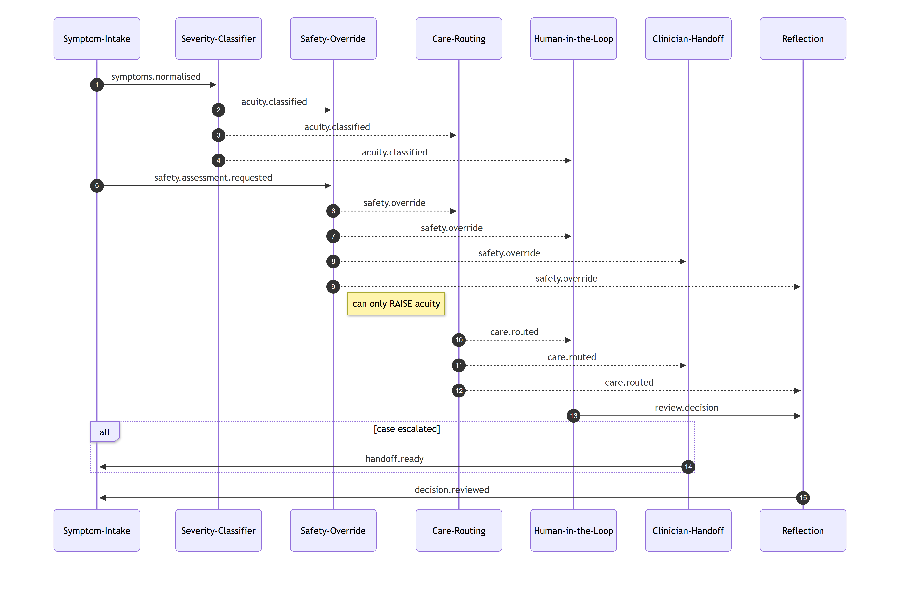

> **"A2A" here means A2A-*style*, not the Google A2A protocol.** The course's Day 2 deck defines A2A
> as a network protocol: Agent Cards published at `/.well-known/agent.json`, a task lifecycle, and
> JSON-RPC between separately deployed agents. CareRoute's bus (`app/messaging.py`) carries the same
> *ideas* — typed intents, explicit sender/recipient, subscription-based delivery, a replayable
> conversation log — but the agents run **in one process** and there is no network hop. The mapping is:
> `AgentComms` (what an agent may publish/receive) ≈ an Agent Card's capabilities; `CaseState` ≈ the
> A2A task object; the bus history ≈ the task's message log. Likewise there is **no MCP** tool gateway
> — tools are plain Python modules gated by `TOOL_ALLOWLIST`. Both protocols are the natural next step
> once agents are deployed as separate services (see §14).

### Who may say what, to whom

Communication is **least-privilege**, exactly like tool access.

| Agent | May publish | Receives |
|---|---|---|
| **Symptom-Intake** | `symptoms.normalised` | `case.opened` |
| **Severity-Classifier** | `acuity.classified` | `symptoms.normalised` |
| **Safety-Override** | `safety.override` | `acuity.classified`, `safety.assessment.requested` |
| **Care-Routing** | `care.routed` | `acuity.classified`, `safety.override` |
| **Human-in-the-Loop** | `review.decision` | `acuity.classified`, `safety.override`, `care.routed` |
| **Clinician-Handoff** | `handoff.ready` | `safety.override`, `care.routed` |
| **Reflection / Critic** | `decision.reviewed` | `safety.override`, `care.routed`, `review.decision` |

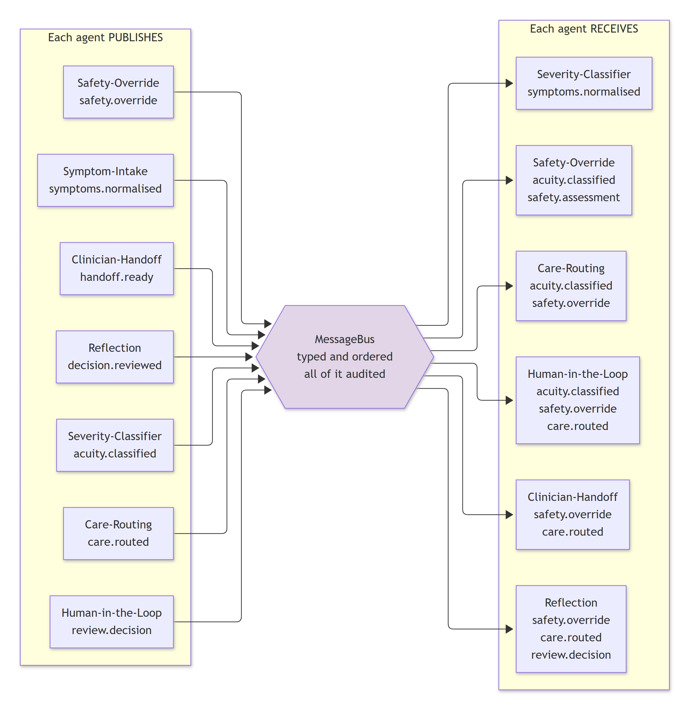

**Enforced, not just documented:** publish an intent you never declared and `enforce_comms()` raises;
read one you never subscribed to and `require_subscription()` raises. `pytest -m comms` — **100 passed**.

### Why the bus is load-bearing, not decoration

A fair question: *couldn't the agents just read shared state?*

They could — and it would hide a real class of bug. Shared state holds only the **latest** value of a
field. The bus holds **what each agent claimed at the moment it acted**. So an agent that quietly
overwrites an upstream decision is invisible in the state and *visible in the conversation*.

The Reflection critic uses exactly that: `verify_announcements()` flags a care tier that no longer
matches what Care-Routing announced, and a Care-Routing that never announced at all. Withhold the
message and the critic cannot see the problem — proven by a test that does precisely that
(`test_reflection_detects_a_tier_changed_without_being_announced`). Delete the bus and this check
cannot exist.

**See it yourself** — real output, 9 messages for one escalated case:

```bash
cd backend && python scripts/show_a2a.py "sudden weakness on one side and slurred speech"
```

```
seq0      intake -> intake      case.opened
seq1      intake -> classifier  symptoms.normalised
seq2  classifier -> broadcast   acuity.classified
seq3      intake -> safety      safety.assessment.requested
seq4      safety -> broadcast   safety.override
seq5     routing -> broadcast   care.routed
seq6        hitl -> reflection  review.decision
seq7  reflection -> intake      decision.reviewed
seq8     handoff -> intake      handoff.ready
```

---

## 5. Three design decisions

### 5.1 It is a hybrid, not an "all-LLM" system

A common assumption about multi-agent AI is that every agent is an LLM call. CareRoute deliberately is
not: **one trained model**, **several bounded LLM steps**, and **deterministic logic where being
predictable matters more than being clever**.

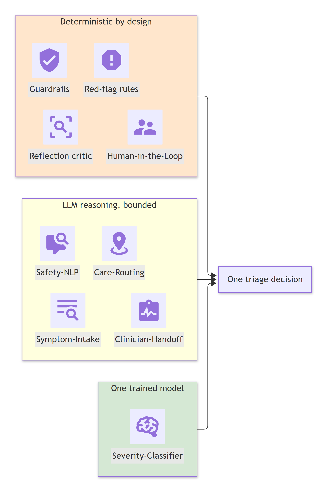

Each worker **declares** which it is, and the build checks the claim: you cannot call yourself an
agent without an inference step *and* more than one possible outcome, and a policy node must carry an
`upgrade_path` describing what real agency would take. `pytest -m capability`.

### 5.2 Every AI step has a deterministic floor

No AI call is load-bearing. Each is tried first and falls back, and the fallbacks chain — so the
system keeps working with no AI at all. That is not an emergency mode: **it is how the entire test
suite runs**, which is what stops the fallback path quietly rotting.

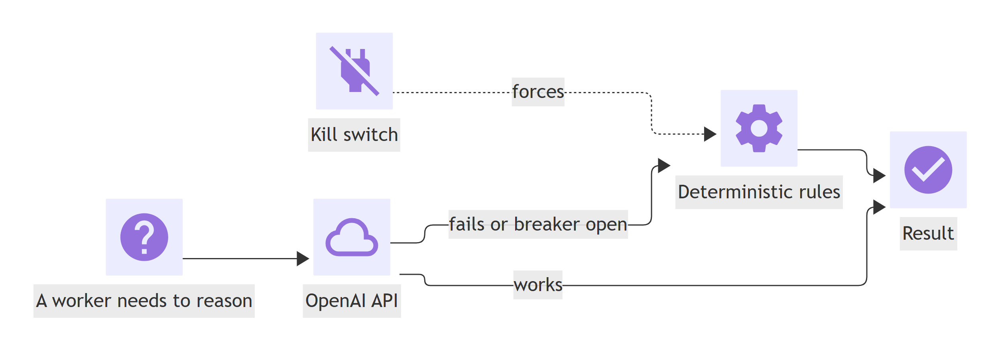

The kill switch (`CAREROUTE_KILL_SWITCH=1`) forces the deterministic path on demand — an answer to
"what if the model misbehaves in production?" that does not require a deploy.

### 5.3 Personal data is removed before the AI sees it

Redaction happens **before** any agent runs, not before storage. The masked text is what the agents
reason about, what gets logged, and what any external LLM provider would ever receive.

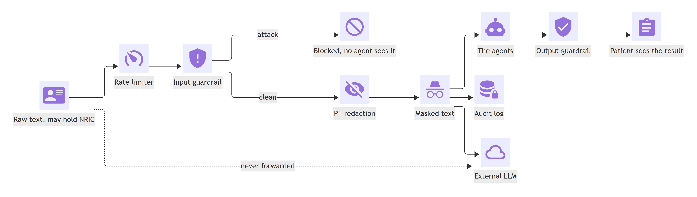

Prompt and response **content is never logged** — only provider names and outcomes. The audit trail is
a SHA-256 hash chain, so an altered or removed entry is detectable rather than merely discouraged.

---

## 6. What we built — by team member

Seven agents, one file per owner, so five people could build in parallel without collisions.

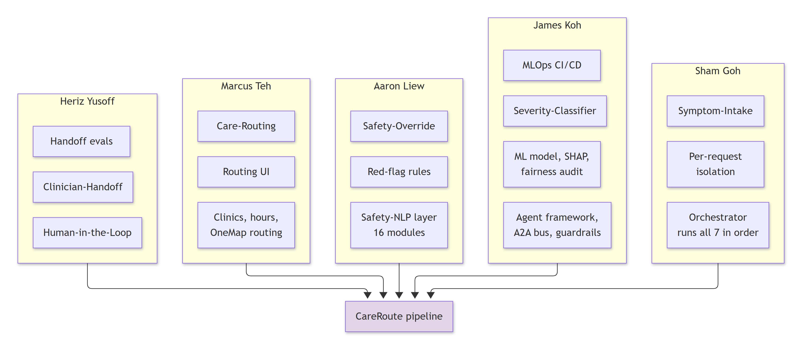

**Ownership is enforced by the build, not by agreement.** Every agent declares an `AgentContract` —
the `CaseState` fields it may write. The shared harness fails the build if an agent writes outside its
lane (`pytest -m contract`). If Care-Routing had set `acuity_code`, it breaks in the author's own test
run, not in a teammate's demo.

| Member | Owns | What they delivered | Page |
|---|---|---|---|
| **Sham Goh** | `intake.py`, `orchestration.py` | Normalises messy, multilingual input. Took over the orchestrator role and gave **every request its own private worker set** — fixing a real bug where two patients' cases could interleave. | [→](docs/team/sham-goh.md) |
| **Koh Guan Chin James** | `classifier.py`, `app/ml/`, platform | The only trained model, with **real SHAP** and a full fairness audit. Built the agent framework, A2A bus, guardrails, audit log and the entire CI/CD pipeline. Found and fixed a drift detector that was silently always reporting zero. | [→](docs/team/james-koh.md) |
| **Aaron Liew** | `safety.py`, `redflags.py`, `safety_nlp/` | The clinical safety interlock, then a **16-module semantic NLP layer** (negation, NER, similarity) that knows *"no chest pain"* differs from *"chest pain"* — added strictly **on top of** the rules, never replacing them. | [→](docs/team/aaron-liew.md) |
| **Marcus Teh** | `routing.py`, `services/onemap.py`, routing UI | Turns urgency into a **real, verified, currently-open clinic** with a travel estimate, with a failsafe that degrades to a clearly-labelled estimate rather than inventing a route. | [→](docs/team/marcus-teh.md) |
| **Heriz Yusoff** | `hitl.py`, `handoff.py` | Decides when a human must review, and builds the **clinician handoff packet** for escalated cases. Built the evaluations checking the summary is faithful and the questions appropriate. | [→](docs/team/heriz-yusoff.md) |

<details>
<summary><b>Each member's component, drawn</b> — click to expand</summary>

**Sham Goh — Symptom-Intake & orchestration**

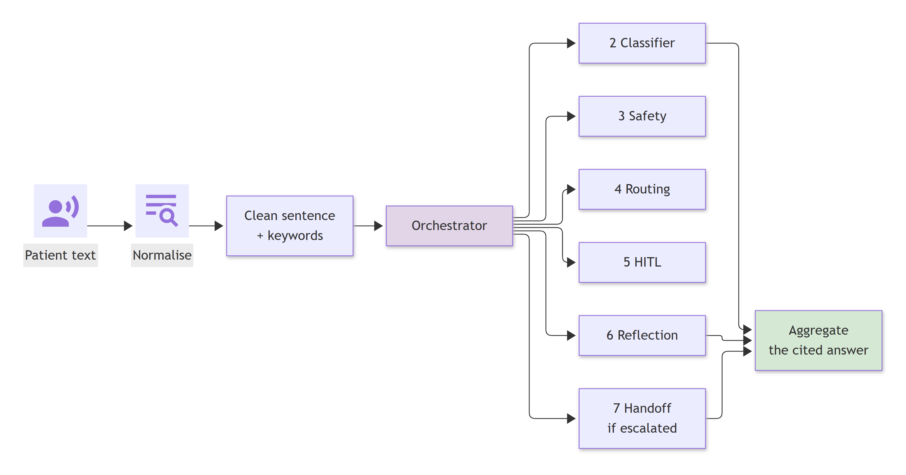

**Koh Guan Chin James — Severity-Classifier & the ML stack**

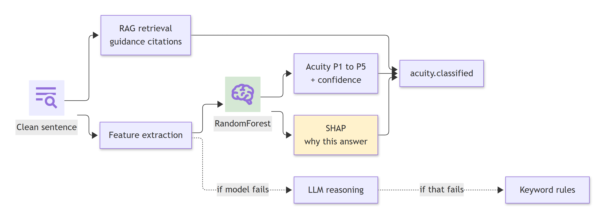

**Aaron Liew — Safety-Override & Safety-NLP**

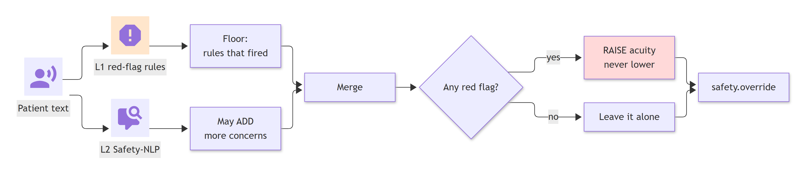

**Marcus Teh — Care-Routing**

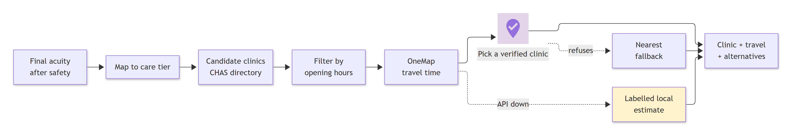

**Heriz Yusoff — Human-in-the-Loop & Clinician-Handoff**

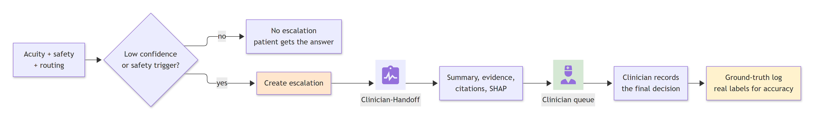

</details>

Full detail per person — role, files owned, declared interface, and the commands that prove it — is in
**[docs/team/](docs/team/README.md)**.

---

## 7. Where each graded module is demonstrated

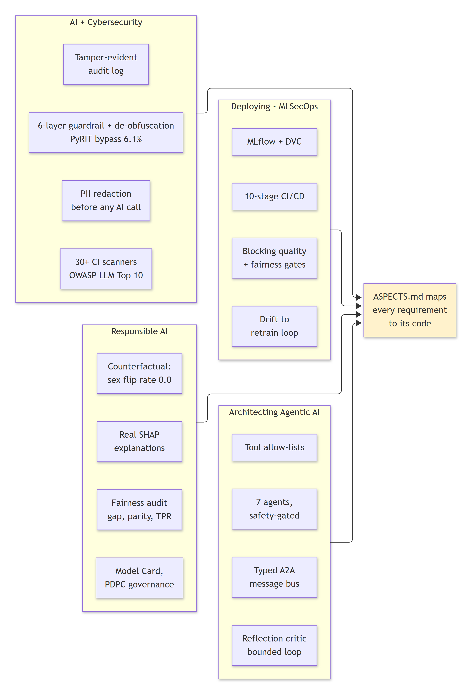

| Module | Demonstrated by | Verify it yourself |
|---|---|---|
| **Explainable & Responsible AI** | Real SHAP explanations, fairness audit (accuracy gap, demographic parity, equal opportunity, counterfactual), drift detection, Model Card, PDPC governance | `GET /api/fairness` · [MODEL_CARD](backend/MODEL_CARD.md) · [GOVERNANCE](docs/GOVERNANCE.md) |
| **AI & Cybersecurity** | Input *and* output guardrails, deterministic red-flag override, tool allow-lists, PII redaction, rate limiting, kill switch, tamper-evident audit log, OWASP-mapped red-teaming | [SECURITY](backend/SECURITY.md) · `pytest -m comms` · `security/` |
| **Architecting Agentic AI** | Seven agents incl. a Reflection critic and an escalation-only Clinician-Handoff, safety-gated pipeline, autonomy levels, **typed A2A-style in-process message bus with least-privilege pub/sub** (§4), agent + tool registries served over the API, correlation IDs on every log line, episodic memory, **hybrid RAG** (chunked dense embeddings fused with lexical TF-IDF, with adaptive context assembly) | `python scripts/show_a2a.py` · `pytest -m comms` · `pytest -m capability` · `GET /api/agents` |
| **Integrating & Deploying (MLSecOps)** | 10-stage pipeline with blocking model-quality / data-validation / lineage / fairness / **train-serve-skew** gates, 80% coverage floor, MLflow registry stages + DVC, drift→retrain loop, champion–challenger promotion, **yield + harvest availability metrics**, batch serving, executive PDF report | [`.gitlab-ci.yml`](.gitlab-ci.yml) · [MLOps](docs/MLOPS.md) |

**Full requirement-to-code traceability: [`ASPECTS.md`](ASPECTS.md).**

---

## 8. How we evaluated it

The evaluation plan is **code, not a document** ([`app/evals/plan.py`](backend/app/evals/plan.py)).
The build fails if any spec is missing a dataset, expected output, metrics or acceptance criteria, if
it claims `implemented` without a real test file, or if a `planned` spec states no blocker. That stops
the plan and the code drifting apart.

**14 of 15 implemented.** Where a safety-critical direction exists, the metric names it — "accuracy"
alone is never the bar.

| # | Evaluation | Owner | Headline metric | Bar | Status |
|---|---|---|---|---|---|
| **E1** | Intake field extraction | Sham | severe-keyword recall; hallucination rate | recall ≥ 0.95; **hallucination == 0.0** | implemented |
| **E2** | Clarifying-question appropriateness | Heriz | ask/no-ask accuracy; safety violation rate | ≥ 0.85; **violations == 0.0** | implemented |
| **E3** | Routing / workflow accuracy | Marcus | care-tier accuracy; under-triage rate | == 1.0; **under-triage == 0.0** | **planned** |
| **E4** | Severity classification | James | red-flag recall; calibration; fairness | recall ≥ 0.95; ECE ≤ 0.05 | implemented |
| **E5** | HITL trigger accuracy | Heriz | recall **and** specificity | recall == 1.0; **specificity ≥ 0.80** | implemented |
| **E6** | Tool-access enforcement | James | forbidden-pair block rate | **== 1.0** | implemented |
| **E7** | Safety red-flag context | Aaron | category coverage; negation handling | all 7 categories, 4 languages | implemented |
| **E8** | Handoff-summary faithfulness | Heriz | hallucination rate; grounding coverage | **== 0.0**; coverage == 1.0 | implemented |
| **E9** | Guardrail effectiveness, scored | James | injection bypass; recall; **false positives** | ≤ 0.02; ≥ 0.95; **≤ 0.05** | implemented |
| **E10** | Retrieval quality | platform | hybrid Recall@2, split by query kind | ≥ 0.90 (measured **0.969**) | implemented |
| **E11** | Critic decision validity | platform | monotonicity violations; invalid-output acceptance | **both == 0** | implemented |
| **E12** | Retrieval **context precision** | platform | fraction of returned context that is relevant | ≥ 0.70 (measured **0.750**, was 0.484) | implemented |
| **E13** | Tool-call accuracy | platform | accuracy; refusal recall; **false-refusal rate** | ≥ 0.95; == 1.0; ≤ 0.05 — measured **1.000 / 1.000 / 0.000** | implemented |
| **E14** | Multi-turn continuity | platform | continuity across the clarifying interview | ≥ 0.90 — measured **0.875** (was 0.750; every confirming answer is now used, denials legitimately match their control) | implemented |
| **E15** | Groundedness / faithfulness | platform | term overlap vs LLM-as-judge | overlap **0.5625**, unusable as a gate; judge unrun in CI | implemented |

**E3 is blocked, and says so in code:** the dataset does not exist and clinic selection has no ground
truth until the clinic directory carries queue depth, distance and opening hours. An unexplained gap
is how a plan rots, so the blocker is a required field.

**Five of these replaced a pass/fail check with a rate over a labelled corpus** (E9, E12–E15), and
each measures **both directions** — not just "was the bad thing caught?" but "how often was a good
thing rejected?". A guardrail that blocks everything, or a tool harness that refuses everything,
passes every refusal test ever written and breaks the product.

What that method found, kept visible rather than quietly fixed:

- **E5's specificity half** caught the minor-trauma blind spot (§9). Recall alone is trivially
  satisfiable by escalating everything, which would defeat the purpose of triage.
- **E9** put the guardrail's false-positive rate at 11% on its first run — *"sprained my ankle
  playing football"* was being refused as off-topic, because the clinical lexicon had no joints or
  extremities in it at all.
- **E12** found that returning a fixed two documents capped context precision at 0.50 *however good
  the ranking*: half of every prompt's guidance block was padding.
- **E14** found that the system asked a patient a clarifying question and never read the answer —
  `state.clarifications` was checked only for emptiness, so "yes, fever and struggling to breathe"
  decided exactly as silence does. Pinned by a strict `xfail` until the 2026-09-26 interview
  (`docs/design/specs/2026-09-26-clarifying-chat-interview-design.md`) folded the answers into the
  classified text and gave the patient a chat thread to answer in.
- **E15** found that the cheap faithfulness check everyone reaches for (does every word appear in
  the source?) scores 0.5625: it calls a flipped negation grounded and rejects every faithful
  paraphrase.
- **E8** was originally carried as a local, unregistered "E7" inside a test file, colliding with
  Aaron's registered E7. Renumbered rather than left to confuse a reader.

```bash
cd backend && pytest -m eval
```

---

## 9. Does it actually work? — the evidence

Everything below is measured. Re-run any of it with the commands in §12.

### The model

| Metric | Result | Required to ship |
|---|---|---|
| Overall accuracy | **0.905** | ≥ 0.75 |
| **Red-flag recall** (catching emergencies) | **0.997** | ≥ 0.95, and ≥ 0.95 in **every** age × sex subgroup (worst 0.971) |
| Calibration error (ECE) | **0.025** | ≤ 0.05 |
| Fairness gap after mitigation | **0.143** (from 0.515) | ≤ 0.35 |
| Counterfactual: does sex change the outcome? | **0.0 — no** (served scoring is sex-blind) | ~0 |

A model missing any of these **cannot be deployed** — the build fails before it is ever saved. Figures
are for `careroute-triage-rf-33e265607d69`, live since 25 Sep 2026; the full audit is in
[`backend/MODEL_CARD.md`](backend/MODEL_CARD.md).

**The live scenario suite** (`report/review/scenario_suite.py`, 32 cases against the deployed AWS demo:
red flags, routing, English/Chinese/Malay/Tamil, injection, PII, staff auth, HITL SLA) passes
**32/32**. A 100-request load test on the demo completed 100/100 with no errors (p95 23 s end to end,
every red-flag case escalated).

### The tests

| Suite | Result |
|---|---|
| Backend (unit + integration + gates) | **1674 passed**, 25 skipped, 1 xfailed (15–55 min depending on machine load — it drives the real pipeline over two gold sets) |
| API contract fuzzing (Schemathesis, blocking in CI) | **677/677** generated cases — every status code and content type is declared in `/openapi.json` |
| Microservice transport (`pytest tests/test_ms_*`) | **69 passed** — includes 20-vignette in-process vs HTTP parity |
| Compose smoke (`scripts/compose_smoke.py`) | a real red-flag triage through all ten containers: `escalated=True acuity=P1_RESUSCITATION` |
| Frontend browser tests (Playwright) | **20 passed** |
| A2A messaging (`pytest -m comms`) | **100 passed** |

The single `xfail` is deliberate and **strict**: it pins the E14 finding that the patient's answer to
a clarifying question is never read. It passes today by failing — and the moment someone fixes the
underlying gap it turns red, forcing the evaluation to be re-scored rather than silently forgotten.

### Honest limitations

Stating these is part of the work, not an admission against it:

- **The training data is synthetic.** It carries a deliberate, realistic bias (the 65+ band is
  under-represented) so the fairness mitigation has something real to fix. Real clinical data would
  need ethics approval this module does not cover.
- **The 65+ female subgroup is still the weakest** at 0.79 accuracy versus 0.93 for the best subgroup.
  Mitigation narrowed the gap substantially; it did not close it.
- **A forest extrapolates badly on symptom pairs it never saw.** The live test found "high fever with
  body aches" served **P5 (self-care)**: aches only ever appeared in self-care training rows, so the
  milder symptom decided. Fixed at root on 25 Sep (five training profiles, all gates re-passed, two
  regression tests), but the class of fault remains: the synthetic data defines what the model knows.
- **An evaluation found a real blind spot**, kept visible rather than hidden: the model had *no
  minor-trauma features at all*, so cuts and sprains were over-escalated to clinicians. Fixed at root
  — three categories added and the model retrained, 26 → 29 features — and the underlying signal is
  still measured on every run (`zeroCoverageRate`) and deliberately **not gated**, because gating it
  would have made the defect look intentional.
- **A patient cannot yet answer a clarifying question.** The agent can ask one, and E2 evaluates the
  asking, but the resume endpoint is not built. This is the largest functional gap, and since
  2026-09-17 it has a number: **E14 scores continuity at 0.750 against a 0.90 bar**, because the
  answer is carried and never read.
- **Faithfulness is instrumented but not gated.** E15 ships both candidates and shows the cheap one
  (term overlap) cannot be the gate at 0.5625. The LLM judge that can be is **never run in CI**,
  which has no provider — it reports `available: false` rather than passing vacuously, and needs an
  agreement study against a live model before a number from it should be trusted.
- **The model artifact is rebuilt by the pipeline, not committed** (`backend/models/` is gitignored).
  Any artifact built before 2026-09-17 is now *rejected on load* by the feature contract rather than
  served, so "an old artifact quietly answering with new features" is no longer a failure mode.
- **E3 is unevaluated** — see §8.

---

## 10. Safety and security

Two different risks, handled separately: *the patient could be harmed by a wrong answer*, and *the
system could be attacked*.

| Control | Where | Risk addressed |
|---|---|---|
| **Input guardrail** — 6 layers, deterministic | `guardrail.screen()` | LLM01 prompt injection / jailbreak |
| **Output guardrail** — screens the rationale | `guardrail.screen_output()` | LLM05 improper output handling |
| **PII/PHI redaction** — NRIC, phone, email, MRN | `redact.py` | LLM02 sensitive-information disclosure |
| **Least-privilege tool allow-lists** | `enforce_tool_access()` | LLM06 excessive agency |
| **Least-privilege messaging** | `enforce_comms()` | Excessive agency, agent-to-agent |
| **Deterministic red-flag override** | `redflags.py` | Clinical safety — un-overridable |
| **Rate limiting** | `ratelimit.py` | LLM10 unbounded consumption |
| **Kill switch** | `config.py` + `llm.py` | ASI10 rogue agents — forces deterministic mode |
| **Tamper-evident audit log** (SHA-256 chain) | `audit.py` | ASI10 — detects altered/removed entries |
| **Staff sign-in** — server-side session | `frontend/lib/staffSession.js` | Unauthenticated access to patient escalations |
| **Security headers** on every API response | `main.py` middleware | MIME sniffing, cross-origin embedding (ZAP) |
| **30+ CI scanners** | `.gitlab-ci.yml`, `security/` | Supply chain, SAST, secrets, CVEs, DAST (ZAP), API fuzzing, LLM red-teaming |

The input guardrail is **six layers** so an injection evading one is caught by the next: hygiene →
Unicode normalisation (homoglyph fold, zero-width strip) → decode-and-rescan (base64/hex/URL) →
injection denylist → structural detection (`<|system|>`, `[INST]`, role JSON) → topical scoping.
Since 25 Sep a **de-obfuscation step** also rescans undone ciphers (ROT13/Caesar/Atbash), reversal,
Morse, binary, stacked base64, Unicode look-alikes (UTS #39) and spaced-out letters. Measured with
Microsoft **PyRIT**'s converters over the attack corpus: bypass rate **82.9% → 6.1%**, with 0 false
positives on the benign set; the residual is lossy encodings no decoder can undo.

Full register: [`backend/SECURITY.md`](backend/SECURITY.md).

**Dependency CVEs are a blocking gate, and it has bitten us.** `scan:trivy-fs` fails the build on any
CRITICAL. Next.js 14.2.35 carried two unauthenticated-RCE CRITICALs (CVE-2026-75604 and
GHSA-2xp9-vwfh-vxw4); the fix was an upgrade to 15.5.24, verified by the Playwright suite
(20/20) before it was pushed. `npm audit` now reports **0 critical**.

---

## 11. The MLOps pipeline

Every push runs a **10-stage GitLab pipeline**. The point is not automation for its own sake — it is
that **a model failing a quality, safety or fairness threshold cannot reach production**, and no human
has to remember to check.

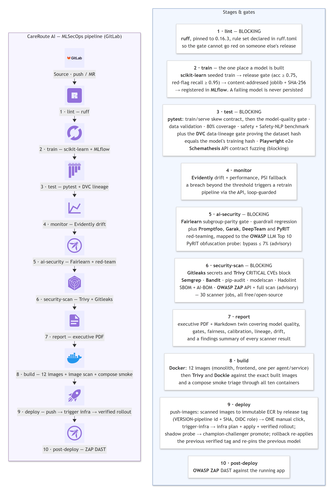

### What blocks a release

| Gate | Threshold |
|---|---|
| `test:model-gate` | **train/serve skew** (the artifact's feature contract must match the code's), then accuracy ≥ 0.75, **red-flag recall ≥ 0.95 overall and in every subgroup**, ECE ≤ 0.05, fairness gap ≤ 0.35 |
| `test:api-fuzz-schemathesis` | the API never 500s and never returns a status or content type its OpenAPI spec does not declare |
| `train:model` release gate | the same floors — a failing model is never even persisted |
| `data:validate` | schema, domain, label balance, hash consistency |
| `test:data-lineage` | the dataset's hash **==** the model's training-data hash |
| `ai-security:fairness-gate` | subgroup accuracy parity within the same ceiling |
| `ai-security:guardrail-regression` | injection blocked, safety override un-overridable |
| `test:backend` | 80% coverage floor |
| `lint:backend` | ruff, pinned to 0.16.3 |
| `scan:secrets-gitleaks` · `scan:trivy-fs` | committed secrets · CRITICAL CVEs |

### The closed drift→retrain loop

Monitoring does not just report. A drift breach fires a retrain, and the retrained model must clear
the same gates *and* beat the current champion before it can replace it.

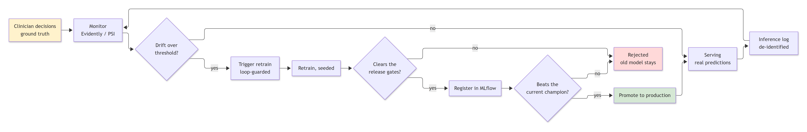

The **loop guard** matters: a pipeline triggered by drift must not itself trigger another, or one
noisy day becomes an infinite retrain loop.

### The five pillars — honest status

| # | Pillar | Status |
|---|---|---|
| 1 | Experiment tracking + model registry | **Runs** — MLflow logs and registers every gated run |
| 2 | Data versioning + lineage | **Runs** — DVC pointer committed, lineage proven by a blocking gate |
| 3 | Monitoring | **Runs** — drift reports, inference log, Prometheus, Alertmanager, and since 2026-09-17 **yield and harvest**: how many requests were served, and how *complete* each served answer was |
| 4 | Continuous training | **Configured** — needs `CAREROUTE_PIPELINE_TRIGGER_TOKEN` to fire |
| 5 | Deployment lifecycle | **Configured** — staging/promotion/rollback defined, never exercised live |

Pillars 4 and 5 are written and wired but unproven in practice. Saying so is more useful than claiming
five green ticks. Detail: **[docs/MLOPS.md](docs/MLOPS.md)**.

### Why "harvest" is on that list

This system is built to **degrade rather than fail**: no embedding model drops it to lexical
retrieval, no map key drops it to a labelled local estimate, no trained model drops it to the
deterministic keyword table. Every one of those still returns a successful answer — which means a
dependency outage is **invisible** to ordinary availability monitoring by construction.

So two numbers are recorded, not one. **Yield** is requests served ÷ requests received (including the
ones that failed, and the ones deliberately shed by the rate limiter — load shedding is the thing
availability work exists to measure, not an excuse to leave rows out of the count). **Harvest** is how
much of each served answer was actually there, scored over five independently-degradable parts. The
alert that matters is the pair: *harvest below 60% while yield is still above 95%* — everyone is being
served, and the answers have quietly stopped carrying their citations, route or model assessment.

---

## 12. Running and checking it

**Prerequisites:** Node ≥ 18, Python ≥ 3.10. No AI provider or API key is required — the system falls
back to deterministic rules.

```bash
./dev.sh                       # backend :8000 + frontend :5173, both hot-reload
                               # then open http://localhost:5173
```

```bash
cd backend
pytest -q                            # all tests as CI sees them (~55 min — two evaluations drive
                                     # the real pipeline over a gold set; it is not hung)
pytest -m intake                     # or classifier | safety | routing | hitl | handoff | reflection
pytest -m comms                      # agent-to-agent messaging
pytest -m capability                 # agent vs policy node, enforced
pytest -m contract                   # did anyone write outside their lane?
pytest -m eval                       # the evaluation plan

python scripts/show_a2a.py "chest pain"      # watch the agents talk
python -m app.ml.train                       # train + gate + register
python -m app.ml.monitor                     # drift report
python -m app.ml.extraction                  # model-extraction probe (AIC Day 1): surrogate agreement vs query budget
python -m app.ml.feature_contract --check    # train/serve skew: does the served artifact match the code?
python -m app.ml.batch_score --from-store    # batch serving: re-score the pending escalation queue

# The scored evaluations, each printing its own report
python -m app.evals.retrieval                # E10 — ranking quality, lexical vs dense vs hybrid
python -m app.evals.context                  # E12 — context precision + the margin sweep behind it
python -m app.evals.tool_calls               # E13 — tool-call accuracy, by failure family
python -m app.evals.continuity               # E14 — multi-turn continuity (slow: 12 real pipeline runs)
python -m app.evals.grounding                # E15 — term overlap vs the judge

# Data versioning (DVC). The remote is this project's GitLab generic package
# registry (.dvc/config). One-time, with a personal/project access token that
# has the `api` scope — the token lives in .dvc/config.local, which is gitignored:
python -m dvc remote modify --local gitlab password <token>
python -m dvc pull                           # fetch the committed dataset snapshot
python -m dvc push                           # publish a changed snapshot (CI does this with its job token)
```

```bash
cd frontend
npm install && npm run test:e2e      # browser tests; backend must be up on :8000
```

```bash
cd frontend && npm install --no-save mermaid @iconify-json/logos @iconify-json/mdi @iconify-json/simple-icons && cd ..
node scripts/render-diagrams.mjs     # regenerate this README's diagram images
```

> [!warning] **If you cloned into OneDrive**, create the Python virtual environment *outside* the repo
> (e.g. `python -m venv C:\venvs\careroute`). OneDrive paths exceed Windows' length limit and package
> installation fails partway with confusing errors.

---

## 13. API and configuration

### Endpoints

| Method & path | Purpose |
|---|---|
| `GET  /api/health` | Liveness + active LLM provider, kill-switch, rate limit, metrics status |
| `POST /api/triage/stream` | **SSE** triage pipeline. Body: `{text, language?, ageBand?, sex?, sessionId?, latitude?, longitude?, transportMode?, ...}` |
| `GET  /api/escalations` | Pending/decided clinician escalations |
| `GET  /api/escalations/{id}` | One escalation's full detail |
| `POST /api/escalations/{id}/decision` | Clinician records a final decision → ground truth |
| `GET  /api/fairness` | Live fairness + drift audit from the trained model |
| `GET  /api/cases/{id}/audit` | Ordered, **hash-chain-verified** audit trail for a case |
| `POST /api/cases/{id}/feedback` | Patient rates/challenges a decision |
| `GET  /api/sessions/{id}/history` | Episodic recall of a session's prior cases |
| `GET  /api/agents` | Agent registry — every worker's contract, tools, comms and capability class |
| `GET  /api/tools` | Tool registry — what exists, and which agent may call it |
| `GET  /metrics` | Prometheus exposition — operational, model-level and answer-completeness metrics |

### Configuration

All via environment (12-factor). Nothing below is required — every one has a safe default.

| Variable | Default | Purpose |
|---|---|---|
| `LLM_PROVIDER_ORDER` | `openai` | Provider try-order |
| `OPENAI_API_KEY` | *(unset)* | Enables the OpenAI provider (read from env only, never logged) |
| `CAREROUTE_KILL_SWITCH` | `0` | `1` forces deterministic-only mode — no LLM |
| `CAREROUTE_RATE_LIMIT_PER_MIN` | `30` | Triage requests per client per minute |
| `CAREROUTE_STAFF_PASSWORD` | *(empty)* | **Frontend.** The staff sign-in password, checked on the server (constant-time). Enforced only when `CAREROUTE_STAFF_API_KEY` is also set. On AWS it comes from Secrets Manager — never commit it |
| `CAREROUTE_STAFF_API_KEY` | *(empty)* | When set, the staff endpoints (`/api/escalations*`, `/api/cases/{id}/audit`, `/api/sessions/{id}/history`) require `X-Staff-Key`. Empty = open, and `/api/health` reports `staffAuth: "open"`. Set it on both the backend and the frontend (the Next server attaches it; the browser never sees it). **Required before any deployment reachable beyond localhost.** |
| `CAREROUTE_MODEL_DIR` | `models` | Where trained model artifacts are persisted |
| `CAREROUTE_REFLECTION_MAX_ITERS` | `1` | Reflection-loop iteration cap (monotone-safe to raise) |
| `ONEMAP_EMAIL` / `ONEMAP_PASSWORD` | *(unset)* | Live travel estimates; unset → labelled local estimate |
| `ONYX_BASE_URL` / `ONYX_API_KEY` | *(unset)* | Route RAG to self-hosted Onyx (screened for indirect injection); falls back to the built-in retriever |
| `CAREROUTE_RAG_EMBEDDINGS` | `auto` | `auto` uses the local ONNX embedder when `fastembed` is installed (hybrid dense + lexical retrieval), else lexical only. `openai` is explicit opt-in — it is a new egress path for patient text. `off` forces lexical |
| `CAREROUTE_SSE_HEARTBEAT_SECONDS` | `10` | Keepalive cadence (keep under Next's 30 s proxy idle timeout) |
| `CAREROUTE_CORS_ORIGINS` | local dev servers | Browser origins allowed to call the API |

Full list, including the security and monitoring variables:
[Technical Reference](docs/TECHNICAL_REFERENCE.md#configuration).

---

## 14. What we would do next

Honest next steps, in the order we would take them:

| Priority | Work | Why |
|---|---|---|
| 1 | **Tune the Reflection critic on the deciding turn** | Done 2026-09-26: the clarifying interview (up to four questions, as a chat, answers screened by the same guardrail as the complaint) replaced the unanswerable single question, and E14 moved from 0.750 to 0.875. What remains is that the LLM critic still escalates routine complaints at 0.7 confidence ("stomach pain since yesterday"), so most live decided turns end in clinician review. |
| 2 | **Run the faithfulness judge against a real provider** | E15 ships the instrument and CI has no provider, so the gate has never executed. Before trusting a number from it: an agreement study against the 16 hand-labelled cases. |
| 3 | **Finish E3 (routing accuracy)** | Blocked on a dataset and on the clinic directory carrying queue depth and distance. |
| 4 | **Close the 65+ female accuracy gap** | 0.79 vs 0.96 for the best subgroup — mitigation narrowed it but did not close it. |
| 5 | **A durable store, then schedule the batch re-score** | `app/ml/batch_score.py` exists and mutates nothing; there is no nightly run because the in-memory store gives an out-of-process job nothing to read. |
| 6 | **Exercise pillars 4 and 5 for real** | Continuous training and the deployment lifecycle are configured but never run against a live environment. |
| 7 | **Upgrade the two policy nodes** | HITL and Reflection declare an `upgrade_path` to genuine agency; neither has been taken. |
| 8 | **A held-out query set for retrieval** | `CONTEXT_MARGIN` (E12) was tuned on the same 32 queries it is scored on. That is tuned, not validated. |

With real clinical data and ethics approval, the synthetic dataset would be the first thing replaced —
every fairness number in this README is measured against a deliberately-biased synthetic distribution,
and would need re-establishing on real data.

---

## 15. Glossary

| Term | Meaning |
|---|---|
| **Acuity / P1–P5** | How urgent a case is. P1 = resuscitation (immediate), P5 = non-urgent. Singapore's public hospitals use this Patient Acuity Category scale. |
| **Triage** | Sorting patients by urgency so the sickest are seen first. |
| **Red flag** | A symptom that means "escalate now regardless" — e.g. chest pain, stroke signs. |
| **Under-triage** | Rating a case *less* urgent than it is. The dangerous direction, which is why recall on severe cases is weighted above overall accuracy throughout. |
| **CHAS** | Community Health Assist Scheme — subsidised GP clinics in Singapore. |
| **A&E / ED** | Accident & Emergency / Emergency Department. |
| **HITL** | Human-in-the-loop — a person reviews before the decision stands. |
| **SHAP** | A method for attributing a prediction to its input features — "why did the model say that". |
| **Calibration / ECE** | Whether a stated 80% confidence really means right 80% of the time. ECE measures the gap. |
| **Drift / PSI** | Whether live data has moved away from training data. PSI is the measure used here. |
| **Agent vs policy node** | An agent reasons and has more than one possible action. A policy node applies fixed logic. Each worker declares which it is, and the build checks. |
| **A2A** | Agent-to-agent — the typed in-process message bus in §4. A2A-*style*; not Google's A2A network protocol (no Agent Cards, no JSON-RPC). |
| **OWASP LLM Top 10** | The standard list of LLM security risks (injection, data disclosure, excessive agency…). |
| **PDPC** | Singapore's Personal Data Protection Commission, whose Model AI Governance Framework we self-assess against. |

---

## 16. Further reading

| Document | What's in it |
|---|---|
| **[Who did what](docs/team/README.md)** | A page per member — role, contribution, diagram, proof commands |
| **[Architecture](docs/ARCHITECTURE.md)** | Logical and physical architecture, deployment diagram, target cloud, design concepts, framework decision record |
| **[How it works](docs/HOW_IT_WORKS.md)** | The three design decisions, in depth |
| **[MLOps](docs/MLOPS.md)** | Stages, gates, the retrain loop, the current model's numbers |
| **[Diagram sources](docs/diagrams/README.md)** | The Mermaid source behind every image here, and how to regenerate |
| **[Technical Reference](docs/TECHNICAL_REFERENCE.md)** | Every agent contract, API endpoint, config variable, test and CI job |
| **[`ASPECTS.md`](ASPECTS.md)** | Every course requirement mapped to the code that satisfies it |
| **[Model Card](backend/MODEL_CARD.md)** | Intended use, training data, metrics, limitations |
| **[Security register](backend/SECURITY.md)** | OWASP LLM Top 10 risk register |
| **[Governance](docs/GOVERNANCE.md)** | PDPC Model AI Governance self-assessment |
| **[Obsidian vault](docs/vault/)** | The team's working notes — design, evaluation plan, changelog, roadmap |
