
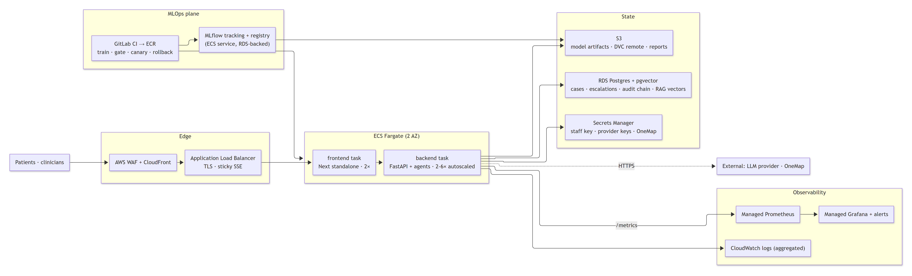

# CareRoute AI — Architecture

*Architecting Agentic AI Solutions, Day 4 deliverable: logical architecture, physical architecture,
deployment diagram, target cloud architecture, design concepts, and the framework decision record.*

This page is written in the module's own vocabulary so a reader can find each Day 4 item by its
heading. Everything here describes the code as it is on the integration branch; the one section that
describes something **not** built is labelled *target, not deployed*.

Related: [README §2](../README.md#2-the-system-and-how-it-works) (overview) ·
[Technical Reference](TECHNICAL_REFERENCE.md) (every contract and endpoint) ·
[How it works](HOW_IT_WORKS.md) (the three design decisions) · [MLOps](MLOPS.md) (the pipeline).

---

## 1. Logical Architecture

### 1.1 Architecture style — named

CareRoute is a **layered, call-and-return web application** whose middle layer is a **safety-gated
pipeline of agents coordinated over an in-process publish/subscribe bus**. In the Day 4 catalogue:

| Style | Where it applies | Why this and not the alternative |
|---|---|---|
| **Layered / call-and-return** | Browser → Next server → FastAPI → agents → tools. Each layer calls down and returns up. | One request has one owner and one audit trail. A pure event-driven system would make "which case is this event for?" a distributed problem. |
| **Pipeline (pipes-and-filters)** | The seven agents run in a fixed, safety-gated order (`orchestration.py`). | Clinical safety needs an order that cannot be re-negotiated at runtime: the deterministic red-flag override must run before routing and cannot be skipped. |
| **Publish/subscribe (event-driven, in-process)** | Agents publish typed intents to `messaging.py`; peers receive only what they subscribed to. | Least-privilege communication and a replayable conversation log, without a network broker the prototype does not need. |
| **Supervisor / orchestrator-worker (multi-agent topology)** | Symptom-Intake holds the orchestrator role and sequences five workers plus a critic. | A single coordinator is the topology the module recommends when the task decomposition is known in advance. |
| **Not used: microservices, hierarchical or network agent topologies** | — | Seven agents in one process is the honest scale; the physical section explains what would change if they were split. |

### 1.2 Agents and their roles

| Agent | Role (module vocabulary) | Autonomy | Owns |
|---|---|---|---|
| **Symptom-Intake** | Orchestrator + first worker: normalises multilingual input, sequences the rest | L2 | Sham Goh |
| **Severity-Classifier** | Worker with a trained model (RF + SHAP), LLM secondary, keyword fallback | L3 | James Koh |
| **Safety-Override** | Worker with a semantic red-flag layer over the deterministic rules; the rule-based override itself stays un-overridable | L2 | Aaron Liew |
| **Care-Routing** | Worker with tools: verified clinic selection via a **bounded ReAct loop** (travel estimate, hours lookup, ≤ 3 turns) | L2 | Marcus Teh |
| **Human-in-the-Loop** | Gate: escalates on low confidence, safety rule or P1/P2; asks clarifying questions | L2 | Heriz Yusoff |
| **Reflection** | Critic (evaluator-optimizer): reviews the assembled decision, can force escalation | L2 | James Koh |
| **Clinician-Handoff** | Escalation-only worker: summary, citations, follow-up questions for the reviewer | L2 | Heriz Yusoff |

### 1.3 Software components

| Component | Module | Responsibility |
|---|---|---|
| Input guardrail | `app/guardrail.py` | Six-layer screen: injection, jailbreak, off-scope, encoding, length, output screen |
| PII redaction | `app/redact.py` | NRIC, phone, email, MRN masked before any provider or store |
| Rate limiter | `app/ratelimit.py` | 30 requests / minute / client (LLM10) |
| Agent bus | `app/agents/messaging.py` | Typed intents, subscriptions, ordered history (A2A-style, in-process) |
| Case state | `app/agents/base.py` | Working memory, per-agent write lanes enforced by contract tests |
| Agent Registry | `app/agents/registry.py` | The canonical worker set (the test harness re-exports it, so app and tests cannot diverge), plus discovery over each worker's declared `AgentCapability`, served on `/api/agents`. No endpoint or transport field: slide 18's agent-as-tool and agent-as-service modes are declined in writing — see the module docstring |
| Correlation | `app/correlation.py` | Per-request ContextVar + logging filter stamping `correlation_id` and `case_id` on **every** LogRecord, including modules that never opted in. Inbound `X-Correlation-ID` / `X-Request-ID` honoured and sanitised (log injection, length), echoed on the response |
| Tool registry | `app/tools/registry.py` | Central catalog served on `GET /api/tools`; `routing.ROUTING_TOOL_REGISTRY` declares the schemas the routing model may call, allow-list enforced at use |
| LLM provider chain | `app/llm.py` | OpenAI API only (local-tool providers removed), per-provider timeout and circuit breaker, kill switch |
| Severity model | `app/ml/model.py` | 200-tree RF, isotonic calibration, local + global SHAP, fairness audit |
| Retrieval | `app/rag.py` | **Hybrid** when an embedder is present: chunked dense embeddings fused with lexical TF-IDF by Reciprocal Rank Fusion. Lexical-only without one, which is what CI runs. No external vector store — the corpus is committed and embedded in-process |
| Store | `app/store.py` | Cases, escalations, episodic memory (24 h TTL, digest-verified), seeded snapshot |
| Audit log | `app/audit.py` | SHA-256 hash-chained per-case trail |
| Metrics | `app/metrics.py` | Prometheus: requests, latency, tokens, cost, guardrail blocks, escalations |

### 1.4 Pattern vocabulary — how each stage maps to the taught names

| Stage in CareRoute | Anthropic workflow name | Ng's four patterns | LangGraph topology |
|---|---|---|---|
| Intake → Classifier → Safety → Routing → HITL | **Prompt chaining** (fixed sequence, gates between steps) | Multi-agent | Supervisor, fixed edges |
| Classifier: model → LLM → keywords | **Routing** by capability availability (not by task type) | Tool use | Conditional edge |
| Routing's tool loop | **Autonomous agent, bounded** (reason → act → observe, ≤ 3 turns) | Tool use + Planning | Cycle with a turn budget |
| Reflection over the assembled decision | **Evaluator-optimizer** (one corrective pass) | Reflection | Cycle, one iteration |
| HITL clarification handshake | **Human reflection** | — | Interrupt / resume |
| Not present | Parallelization, orchestrator that *decides* subtasks | — | Hierarchical, network |

### 1.5 Memory types

| Type | Present? | Where |
|---|---|---|
| Working (per-case) | Yes | `CaseState`, isolated per request |
| Episodic (cross-visit) | Yes, volatile | `store.recall_session`, in-memory, 24 h TTL, integrity digest |
| Semantic (vector) | Yes, in-process | Chunked dense embeddings over the committed corpus (`rag_embed`, local ONNX), fused with lexical by RRF. A managed vector DB remains a target item (§4); the embeddings themselves are no longer one |
| Procedural | No | Prompts and rules are code constants, not learned |

---

## 2. Physical Architecture

### 2.1 Technology stack, with justification

| Component | Technology | Why |
|---|---|---|
| Frontend | Next.js 15 (App Router), React 18, CSS Modules, Recharts | Same-origin `/api` proxy makes SSE trivial; the standalone output keeps the image small; the Route Handler lets a server-side secret guard staff calls without touching the browser. |
| Backend | FastAPI + uvicorn, Python 3.12 | Async streaming responses for SSE; Pydantic models are the API contract; the ML stack is Python. |
| Agents | Plain Python classes, no framework | See the decision record in §6. |
| Model | scikit-learn RandomForest (200 trees), `CalibratedClassifierCV`, SHAP `TreeExplainer`, in-repo local surrogate (agreement audit), raise-only group thresholds (post-processing) | Interpretable, fast on CPU, exact SHAP for trees, no GPU. |
| LLM | Provider chain: OpenAI-compatible HTTP only | No provider is required; the deterministic path runs the test suite. |
| Retrieval | Chunked dense embeddings (local ONNX) fused with TF-IDF cosine by RRF, over a committed corpus | Auditable and dependency-light: no vector DB to operate, and the lexical path still answers when no embedder is present. Measured on the 32-query E10 gold set — hybrid Recall@2 0.969 / MRR 0.917 against lexical 0.500 / 0.500, because lexical scores 1.0 on queries sharing the document's words and 0.0 on paraphrases. |
| Storage | In-process dicts, seeded snapshot | Honest for a prototype; everything is lost on restart, and the target replaces it (§4). |
| Observability | Prometheus, Alertmanager, Grafana (compose) | Scrapes `/metrics`; alert rules for guardrail spikes, escalation anomalies, backend down. |
| Packaging | Multi-stage Dockerfiles: `python:3.12-slim`, `node:20-alpine` | Same image dev → prod; build once. |
| CI/CD | GitLab CI, 10 stages, 69 jobs | Train, gate, scan, test, canary logic, notify. |
| Data / experiments | DVC (local), MLflow (sqlite locally) | Lineage and run tracking; remote and tracking server are configuration items still to set. |

### 2.2 Deployment model — named and justified

Of the four models in the Day 4 deck (single container · multiple containers · hybrid · Kubernetes),
CareRoute is **hybrid: multiple containers on a single host**.

- The **core pipeline is one container**: all seven agents, the model, the guardrail and the store run
  in one FastAPI process. Splitting agents into services would add a network hop and a broker to a
  conversation that today completes in one request, and would turn the in-process bus into a
  distributed-tracing problem before there is any load to justify it.
- **Supporting concerns are separate containers**: the frontend (different runtime, different
  scaling profile), and Prometheus / Alertmanager / Grafana (off-the-shelf images that must not share
  a failure domain with the API).
- **Not Kubernetes**: there is no traffic that needs scheduling across nodes, and the repository has no
  cluster to deploy to. The target architecture (§4) names the managed equivalent.

`docker compose up` brings up the five containers; the deployment diagram below is that topology.

### 2.3 Non-functional requirements and how they are met

| NFR | Requirement | How it is addressed | Evidence |
|---|---|---|---|
| **Clinical safety** | A red flag must never be under-triaged | Deterministic override runs before routing; cannot be overridden by any model; P1/P2 always escalate | Red-flag recall 0.957 gate ≥ 0.95, `pytest -m safety` |
| **Availability of a decision** | An answer even with every external service down | Every worker has a deterministic fallback; provider chain with breaker; kill switch forces the rules path | Full test suite runs with no LLM |
| **Latency** | Interactive streaming | SSE with 10 s keepalive; per-provider timeouts; OneMap route cache 512 entries / 5 min; external calls bounded to the final shortlist | Locust job exists; no CI p95 baseline yet (advisory) |
| **Privacy** | No identifiers reach a provider or a log | Redaction before provider and store; PII egress gate over every CI artifact; prompts never logged | `scan:pii-egress` blocking |
| **Security** | Injection, leakage, excessive agency, access | Six-layer guardrail; output screen; tool and message allow-lists; staff API key; rate limit | `SECURITY.md`, `guardrail-score` 0 % bypass |
| **Fairness** | Subgroup gap within tolerance | Oversampling mitigation; gate ≤ 0.35; named metrics served | Gap 0.549 → 0.170 |
| **Explainability** | Every decision explained, locally and globally | Per-case SHAP with provenance label; global SHAP + partial dependence on the Governance page | `/api/fairness`, final event |
| **Observability** | Operators see load, cost, blocks, escalations | Prometheus counters and histograms; Grafana dashboard; Alertmanager rules | `monitoring/` |
| **Reproducibility** | Same data → same model | Seeded training; content-addressed artifact; sha256 on data and model | `data:version --check` |
| **Loop safety** | No runaway agent | ≤ 9 orchestration turns; ≤ 3 tool turns in routing; repeat suppression | `test:agent-graph`, `test_routing_react.py` |

---

## 3. Deployment diagram (UML)

Stereotypes follow UML deployment notation: «device», «execution environment», «artifact»,
«component». Dashed edges are optional external calls the system runs without.

Source: [`diagrams/src/deployment-diagram.mmd`](diagrams/src/deployment-diagram.mmd).

Ports: frontend container 3000 → host 8080; backend 8000; Prometheus 9090; Alertmanager 9093;
Grafana 3000. In local development the Next dev server runs on 5173 and proxies `/api` to 8000.

---

## 4. Target cloud architecture — *target, not deployed*

Nothing in this section exists. The repository's Terraform job is a plan-only stub and the canary
job has no target. This is the architecture the current design was shaped to fit, so that moving to
it is configuration and persistence work rather than a redesign.

Source: [`diagrams/src/cloud-target.mmd`](diagrams/src/cloud-target.mmd).

| Concern | Today | Target | What changes in code |
|---|---|---|---|
| Compute | compose on one host | ECS Fargate across two AZs, backend autoscaled on CPU and request rate | Nothing: the images are already stateless per request |
| State | in-memory dicts | RDS Postgres (cases, escalations, audit chain) with pgvector for retrieval | `store.py` behind a repository interface; `rag.py` swaps TF-IDF for embeddings |
| Secrets | `.env` and CI variables | Secrets Manager injected as task env | Nothing |
| Model artifacts, data | local `models/`, DVC without remote | S3 as DVC remote and MLflow artifact store; registry-driven serving (`models:/…@champion`) | `get_model()` loads from the registry URI |
| Edge | none | WAF + CloudFront + ALB with sticky sessions for SSE | Nothing |
| Observability | compose Prometheus / Grafana | Managed Prometheus and Grafana; CloudWatch for aggregated logs | Nothing: same `/metrics` |
| Delivery | GitLab CI → ECR → infra pipeline → ECS rolling deploy with alarm rollback (configured, not yet applied) | Native blue/green or canary | AWS provider 6.x in `careroute_ai_infra` |

NFR impact: availability moves from single-host to multi-AZ; latency is unchanged per request; privacy
gains encryption at rest and audited secret access; cost is dominated by the LLM provider, which the
token and cost counters already meter.

---

## 5. Design concepts from Day 4 — checklist

| Concept | Status | Where |
|---|---|---|
| Rate limiting | Implemented | `ratelimit.py`, 30 / min / client, trusted-proxy aware |
| Caching | Implemented | OneMap route cache (TTL 5 min, 512 entries); model warm-up at startup |
| Streaming (SSE) instead of WebSockets | Implemented | POST stream with keepalive; chosen over WebSockets because the flow is one-way and proxies handle it |
| API gateway | Partial | The Next server is the single ingress in compose; a real gateway (WAF + ALB) is target |
| Load balancing, replication | Target | ALB across Fargate tasks; RDS multi-AZ |
| Message broker, service discovery, service mesh | Not needed at this scale | The bus is in-process; documented as the trigger to revisit if agents become services |
| Circuit breaker, timeout, retry | Implemented | Per-provider breaker (3 failures, 30 s cooldown, half-open trial); timeouts everywhere |
| Kill switch | Implemented | `CAREROUTE_KILL_SWITCH` forces the deterministic path |
| Health and readiness | Implemented | `/api/health` reports provider, breaker, kill switch and staff-auth state; compose healthchecks |

---

## 5a. Microservice deployment — one agent, one container

The application is split so that each agent is its own service; the deployment
puts them all on one compute to keep cost down. The two are independent: the
same images run as one ECS task today and as one ECS service each tomorrow.

| Container | Port | Role |
|---|---|---|
| intake-gateway | 8000 | public API, SSE, guardrails, **intake agent + orchestrator**, message bus, audit |
| classifier-agent | 8101 | Severity Classifier (the only agent image with the trained model) |
| safety-agent | 8102 | Safety Override (red-flag rules + semantic layer) |
| routing-agent | 8103 | Care Routing (clinic data, GoWhere hours, OneMap) |
| reflection-agent | 8104 | Reflection / Critic |
| hitl-agent | 8105 | Human-in-the-Loop decision |
| handoff-agent | 8106 | Clinician Handoff |
| llm-gateway | 8107 | the only container with an LLM provider key |
| rag-service | 8108 | guideline index + embedder, shared by every agent |
| redis | 6379 | escalation queue, case store, audit trail (durable) |

**How a triage flows.** The gateway runs the same fixed, safety-gated order as
before and calls each agent with `POST /v1/invoke` (the case state plus the
agent's inbox). The agent runs its real worker class and replies with the
fields it changed and the message it announces. The gateway accepts a reply
only inside that agent's declared lane (`CONTRACT.writes`) and message intents
(`COMMS.publishes`) — the same least-privilege rules the in-process tests
enforce, now enforced at the network boundary.

**When an agent is down**, the case still completes and is never less cautious:
a missing classifier, safety, routing or HITL answer escalates the case to a
clinician; a missing Safety answer also fails the route gate closed. The
`AgentDown` alert fires, because nothing else would look broken.

**Why split this way.** Split along secrets (llm-gateway), state (redis),
resource profile (rag-service, classifier) and sharing (rag, llm); keep pure,
deterministic safety code (guardrail, redaction, red-flag rules) in-process so
it can never fail over the network.

**Transport is a switch, not a rewrite.** `AGENT_TRANSPORT=inprocess` (the
default) keeps every worker in one process, which is what the test suite and the
`monolith` image run; `http` is what the containers run. `tests/test_ms_transport_parity.py`
asserts all 20 gold vignettes reach the identical decision and agent
conversation either way, so the split is a deployment choice rather than a
second behaviour to maintain.

Run it: `docker compose up --build`. Spec:
`docs/design/specs/2026-09-19-agent-microservices-design.md`.

---

## 6. Decision record — no agent framework

**Decision.** The agents are plain Python classes coordinated by hand-written orchestration; no
LangGraph, CrewAI, AutoGen or OpenAI Agents SDK.

**Context.** The Day 3 PM comparison weighs frameworks on graph expressiveness, state management,
human-in-the-loop support, observability, and vendor coupling. CareRoute's graph is a fixed,
safety-gated sequence with two bounded cycles (Reflection, routing's tool loop) and one interrupt
(HITL clarification).

**Why not a framework.**

- *Safety gates are code, not graph edges.* The red-flag override must be impossible to reorder or
  skip. In a framework that is a convention; here it is a test that fails the build
  (`pytest -m contract`, `test:agent-graph`).
- *Least privilege is enforced at the call site.* `enforce_tool_access` and `enforce_comms` sit
  where the tool or message is used. Frameworks put tool binding on the model call, which is one
  layer too high to test the way this project tests it.
- *Five people own one file each.* The contract tests make ownership mechanical. A framework's
  shared graph definition would be a merge hot-spot.
- *The deterministic path is first-class.* Every worker runs with no LLM; frameworks assume one.

**What it costs.** No built-in tracing or replay UI (Prometheus and the audit log carry that);
routing and parallelization patterns are hand-rolled; moving to a hierarchical or network topology
would mean adopting a framework then. That is the trigger to revisit this decision.

**Consequences accepted.** The pattern vocabulary in §1.4 is therefore a *mapping* onto the taught
names, not a framework's node types.
